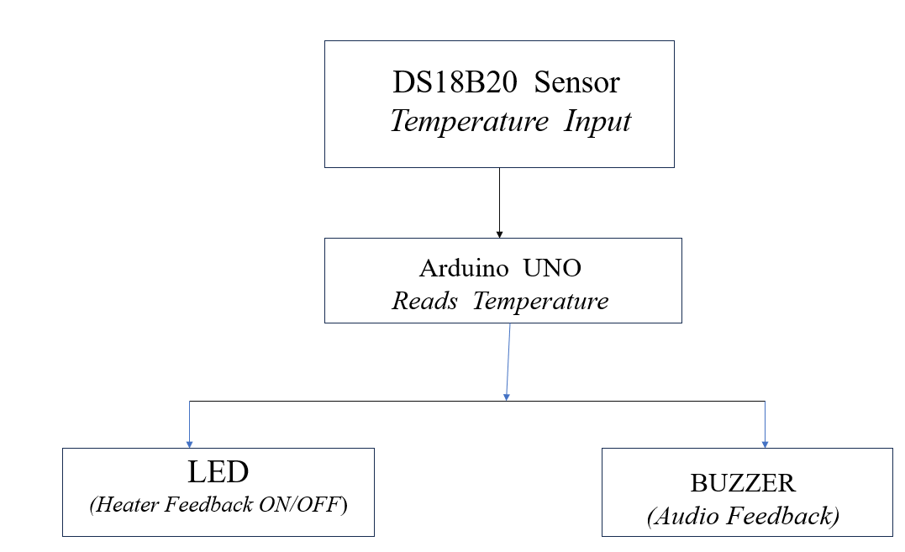
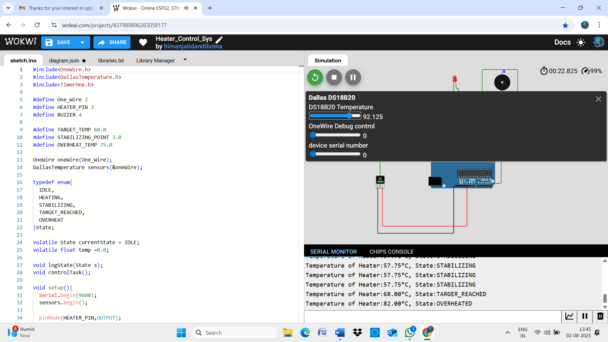

# Timer-Based Heater Control System Using Arduino UNO and DS18B20

This  Project implements a basic heater control system using an Arduino UNO, a DS18B20 temperature Sensor, and buzzer.The system periodically read the temperature and controls a heater to maintain a target temperature ,giving feedback using a buzzer .It uses  at  Timer interrupt to ensure periodic execution erery 1 second.
# Project About
Continously monitors temperature using a DS18B20 temperature Sensor
Controls a heater using State based logis
Activates Buzzer during heating or overheat conditions.
Uses timer interrupts for consistent ,non-blocking operation.

# Its works

- States:
  - `HEATING`: When temperature is below 58°C.
  - `STABILIZING`: When temperature is between 58°C and 60°C.
  - `TARGET_REACHED`: When temperature is 60°C or above but below 75°C.
  - `OVERHEAT`: When temperature exceeds 75°C.
- Timer Interrupt (1s): Reads temperature, updates system state, and controls outputs.
  Output Devices:
  - LED or relay simulates the heater (connected to pin 3).
  - Buzzer alerts when heating or overheating (connected to pin 4).
- Logging : Every second, the system prints temperature and state to the Serial Monitor.

# Block Diagram 

#  Wokwi Simulation Link

-  https://wokwi.com/projects/437989896283058177

# Simulation Output

##  Project Files

- `sketch.ino` – main Arduino code
- `diagram.json` – Wokwi circuit layout
- `README.md` – this file

